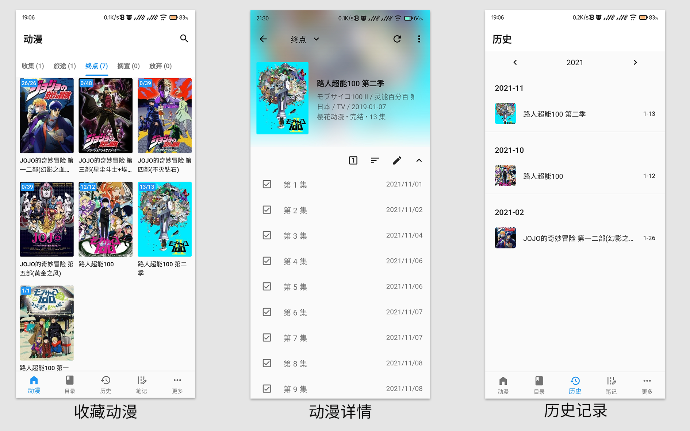
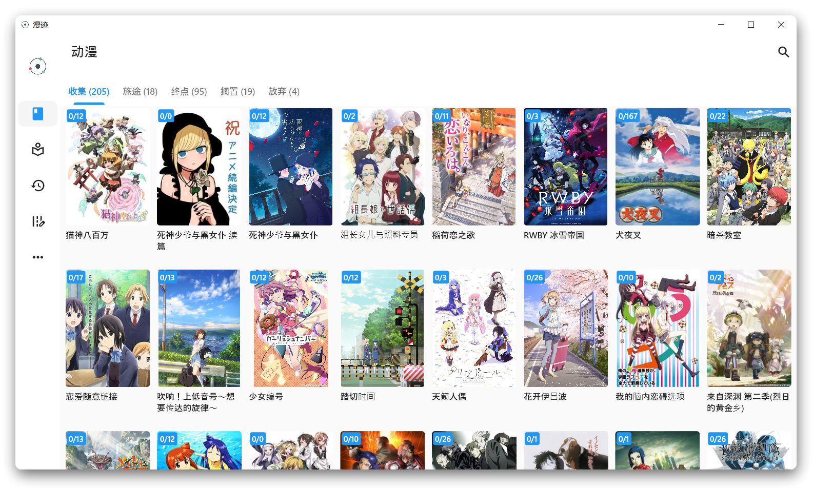

[GitHub](https://github.com/linyi102/anime_trace) / [Gitee](https://gitee.com/linyi517/anime_trace) / [帮助文档](https://www.yuque.com/linyi517/fzfxr0)

## 下载地址

[下载地址 1：蓝奏云](https://wwc.lanzouw.com/b01uyqcrg?password=eocv) 密码：eocv

**注意：如果没有使用备份功能，更新 App 时请直接安装。否则在没有备份的情况下卸载 App，会造成数据丢失。**

## 介绍

因为自己总喜欢把看过的动漫记录下来，可是手动记录实在是有些繁琐，而且效果也不好。所以尝试做了个软件，效果演示如下：

Android 端：

Windows 端：

## 笔记相关问题

完成某集后，单击即可进入笔记编辑页面。

因为数据都是本地存储，所以在笔记中添加图片时，需要为所有图片设置一个根目录，建议把所有图片都放在该目录下。然后再往笔记添加图片。

为保证转移设备后仍然可以显示笔记图片，需要在转移设备时，将旧设备中设置的根目录下的图片全部转移到新设备中的一个新的根目录。然后在新设备的该软件中设置新的根目录即可。

因为数据库中保存的是图片相对路径，因此为笔记添加图片后，**请不要修改图片名字和移动图片**，否则会在笔记页面中无法显示该图片。

## 数据备份问题

Android 平台暂时只能进行 WebDav 备份，Windows 平台可以进行本地备份和 WebDav 备份。

WebDav 备份推荐使用坚果云备份，[点击查看使用方式](https://help.jianguoyun.com/?p=2064)。

**卸载 App 会导致数据也会被删除，因此一定要做好相关备份。**

## 平台相关问题

Android 和 Windows 分别对应 apk 和 zip 文件，建议只使用其中一个平台。

## 第三方包

| packages                                                                                        | 开源协议     |
| ----------------------------------------------------------------------------------------------- | ------------ |
| [fluttericon](https://pub.flutter-io.cn/packages/fluttericon)                                   | unknown      |
| [simple_icons](https://pub.flutter-io.cn/packages/simple_icons)                                 | unknown      |
| [toggle_switch](https://pub.flutter-io.cn/packages/toggle_switch)                               | MIT          |
| [reorderable_grid_view](https://pub.flutter-io.cn/packages/reorderable_grid_view)               | MIT          |
| [webview_flutter](https://pub.flutter-io.cn/packages/webview_flutter)                           | BSD-3-Clause |
| [photo-view](https://pub.flutter-io.cn/packages/photo_view)                                     | MIT          |
| [flutter_rating_bar](https://pub.flutter-io.cn/packages/flutter_rating_bar)                     | MIT          |
| [window_manager](https://pub.flutter-io.cn/packages/window_manager)                             | MIT          |
| [flutter_tab_indicator_styler](https://pub.flutter-io.cn/packages/flutter_tab_indicator_styler) | MIT          |
| [percent_indicator](https://pub.flutter-io.cn/packages/percent_indicator)                       | BSD-2-Clause |
| [dart_ping](https://pub.flutter-io.cn/packages/dart_ping)                                       | BSD-3-Clause |
| [expand_widget](https://pub.flutter-io.cn/packages/expand_widget)                               | GPL-3.0      |
| [get](https://pub.flutter-io.cn/packages/get)                                                   | MIT          |
| [shared_preferences](https://pub.flutter-io.cn/packages/shared_preferences)                     | BSD-3-Clause |
| [sqflite](https://pub.flutter-io.cn/packages/sqflite)                                           | BSD-2-Clause |
| [sqflite_common_ffi](https://pub.flutter-io.cn/packages/sqflite_common_ffi)                     | BSD-2-Clause |
| [path_provider](https://pub.flutter-io.cn/packages/path_provider)                               | BSD-3-Clause |
| [file_picker](https://pub.flutter-io.cn/packages/file_picker)                                   | MIT          |
| [webdav_client](https://pub.flutter-io.cn/packages/webdav_client)                               | BSD-3-Clause |
| [oktoast](https://pub.flutter-io.cn/packages/oktoast)                                           | Apache-2.0   |
| [dio](https://pub.flutter-io.cn/packages/dio)                                                   | MIT          |
| [html](https://pub.flutter-io.cn/packages/html)                                                 | unknown      |
| [cached_network_image](https://pub.flutter-io.cn/packages/cached_network_image)                 | MIT          |
| [archive](https://pub.flutter-io.cn/packages/archive)                                           | MIT          |
| [path](https://pub.flutter-io.cn/packages/path)                                                 | BSD-3-Clause |
| [package_info_plus](https://pub.flutter-io.cn/packages/package_info_plus)                       | BSD-3-Clause |
| [url_launcher](https://pub.flutter-io.cn/packages/url_launcher)                                 | BSD-3-Clause |
| [transparent_image](https://pub.flutter-io.cn/packages/transparent_image)                       | MIT          |
| [cupertino_icons](https://pub.flutter-io.cn/packages/cupertino_icons)                           | MIT          |
