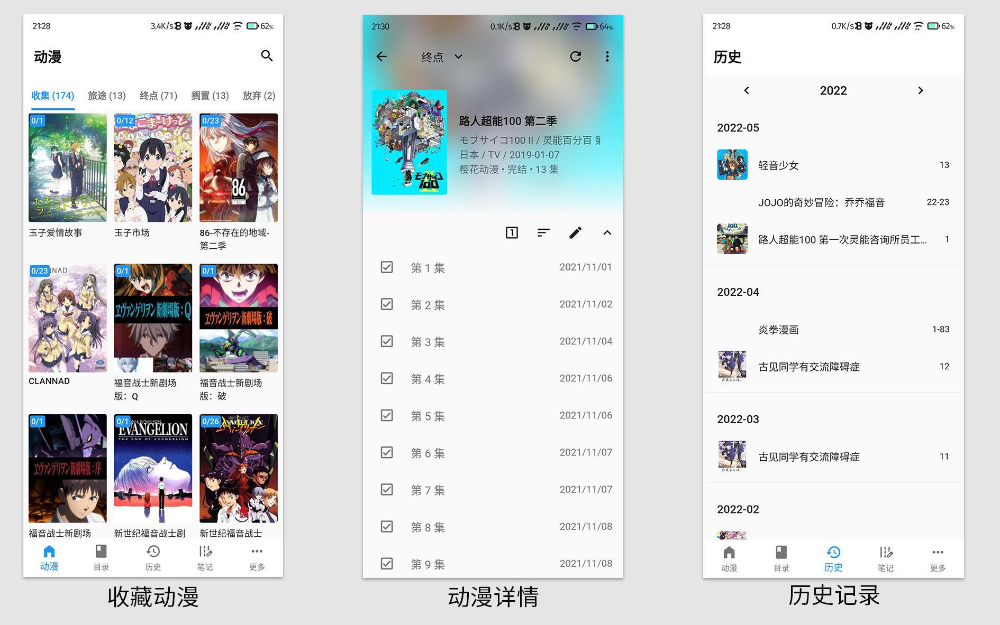

[GitHub](https://github.com/linyi102/anime_trace) / [Gitee](https://gitee.com/linyi517/anime_trace) / [更新进度](https://www.wolai.com/6CcZSostD8Se5zuqfTNkAC) / [更新日志](https://www.wolai.com/gqSMt2YRuNEzZBwwB5dpVA)

下载地址： [蓝奏云(密码：eocv)](https://wwc.lanzouw.com/b01uyqcrg?password=eocv) | [百度网盘](https://pan.baidu.com/s/1_0uQaPOutt3CoTlumZV-_g?pwd=qgbx) 
**注意：如果没有使用备份功能，更新 App 时需要覆盖安装。不要卸载 App 后再安装新版本，这会造成数据丢失！**

因为自己总喜欢把看过的动漫记录下来，可是手动记录实在是有些繁琐，而且效果也不好。 
所以就尝试做了这个软件，效果演示如下：

## 笔记相关问题

完成某集后，单击即可进入笔记编辑页面。

因为数据都是本地存储，所以在笔记中添加图片时，需要为所有图片设置一个根目录，建议把所有图片都放在该目录下。然后再往笔记添加图片。

为保证转移设备后仍然可以显示笔记图片，需要在转移设备时，将旧设备中设置的根目录下的图片全部转移到新设备中的一个新的根目录。然后在新设备的该软件中设置新的根目录即可。

因为数据库中保存的是图片相对路径，因此为笔记添加图片后，**请不要修改图片名字和移动图片**，否则会在笔记页面中无法显示该图片。

## 数据备份问题

Android 平台暂时只能进行 WebDav 备份，Windows 平台可以进行本地备份和 WebDav 备份。

WebDav 备份推荐使用坚果云备份，详细步骤可以参考[坚果云第三方应用授权WebDAV开启方法 | 坚果云帮助中心](https://help.jianguoyun.com/?p=2064)

**卸载 App 会导致数据丢失，因此一定要做好相关备份。**

## 平台相关问题

Android 和 Windows 分别对应 apk 和 zip 文件，建议只使用其中一个平台。

## 最后

如果在使用过程中遇到了什么问题，可以加 qq群 414226908 或者私信我。

## 第三方包

| packages                                                     | 开源协议     |
| ------------------------------------------------------------ | ------------ |
| [get \| Flutter Package](https://pub.flutter-io.cn/packages/get) | MIT          |
| [shared_preferences \| Flutter Package](https://pub.flutter-io.cn/packages/shared_preferences) | BSD-3-Clause |
| [sqflite \| Flutter Package](https://pub.flutter-io.cn/packages/sqflite) | BSD-2-Clause |
| [sqflite_common_ffi \| Dart Package](https://pub.flutter-io.cn/packages/sqflite_common_ffi) | BSD-2-Clause |
| [path_provider \| Flutter Package](https://pub.flutter-io.cn/packages/path_provider) | BSD-3-Clause |
| [file_picker \| Flutter Package](https://pub.flutter-io.cn/packages/file_picker) | MIT          |
| [webdav_client \| Dart Package](https://pub.flutter-io.cn/packages/webdav_client) | BSD-3-Clause |
| [oktoast \| Flutter Package](https://pub.flutter-io.cn/packages/oktoast) | Apache-2.0   |
| [dio \| Dart Package](https://pub.flutter-io.cn/packages/dio) | MIT          |
| [html \| Dart Package](https://pub.flutter-io.cn/packages/html) | unknown      |
| [cached_network_image \| Flutter Package](https://pub.flutter-io.cn/packages/cached_network_image) | MIT          |
| [easy_image_viewer \| Flutter Package](https://pub.flutter-io.cn/packages/easy_image_viewer) | MIT          |
| [archive \| Dart Package](https://pub.flutter-io.cn/packages/archive) | MIT          |
| [path \| Dart Package](https://pub.flutter-io.cn/packages/path) | BSD-3-Clause |
| [package_info_plus \| Flutter Package](https://pub.flutter-io.cn/packages/package_info_plus) | BSD-3-Clause |
| [url_launcher \| Flutter Package](https://pub.flutter-io.cn/packages/url_launcher) | BSD-3-Clause |
| [transparent_image \| Dart Package](https://pub.flutter-io.cn/packages/transparent_image) | MIT          |
| [cupertino_icons \| Dart Package](https://pub.flutter-io.cn/packages/cupertino_icons) | MIT          |

