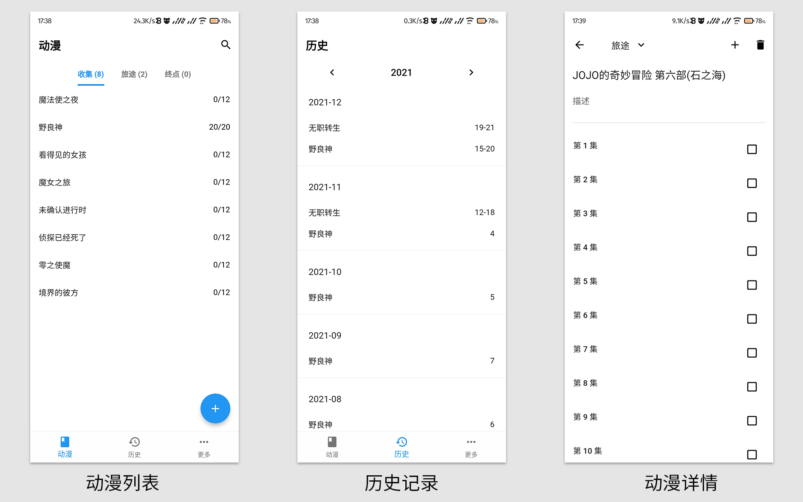

[项目更新进度](https://www.wolai.com/6CcZSostD8Se5zuqfTNkAC) / [Github](https://github.com/linyi102/anime_trace) / [Gitee](https://gitee.com/linyi517/anime_trace)

## 应用截图

## 笔记问题

完成某集后，单击即可进入笔记编辑页面。

因为数据都是本地存储，所以在笔记中添加图片时，需要为所有图片设置一个根目录，建议大家把图片都放在该目录下。

在转移设备后，旧设备的图片转移到新设备时，保持路径一致即可。

因为数据库中保存的是图片相对路径，因此为笔记添加图片后，不能修改图片名字和路径，否则会无法显示。

## 备份问题

Android 平台暂时只能进行远程备份。

远程备份推荐使用坚果云备份，详细步骤可以参考[坚果云第三方应用授权WebDAV开启方法 | 坚果云帮助中心](https://help.jianguoyun.com/?p=2064) 

## 平台相关问题

Android 和 Windows 分别对应 apk 和 zip 文件，由于暂未实现数据互通，因此建议大家只使用其中一个平台。